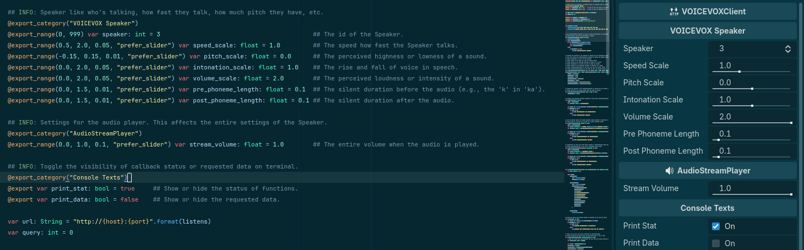
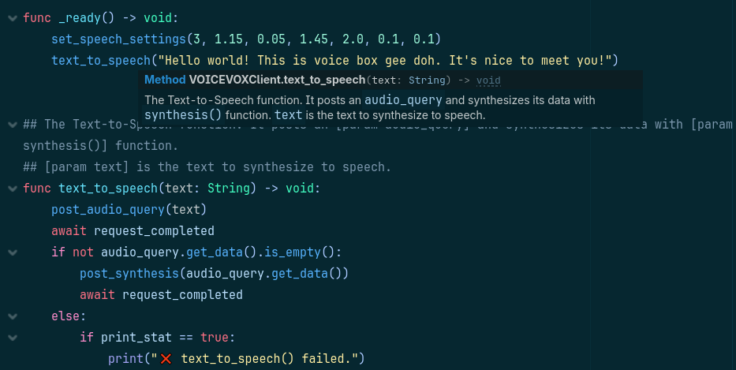

# VOICEVOX Godot
This is a Godot API wrapper for [VOICEVOX Engine](https://github.com/VOICEVOX/voicevox_engine).

Currently, it is not fully developed. I just made a repository to maintain even this early version.
I will make further changes just as I did with my other project [PokeDot](https://github.com/UbeJelly/PokeDot).

## Table of Contents
| Section                           | Description                                                       |
|-----------------------------------|-------------------------------------------------------------------|
| [Usage](#usage)                   | Shows the gist of how it works and its examples to use.           |
| [Setup](#setup)                   | A guide on setting up the TTS engine and running it locally.      |
| [Structure](#structure)           | The structure of the entire project.                              |
| [Methods](#methods)               | The functions available from `VOICEVOXClient` main scene.         |
| [Main functions](#main-functions) | The methods that abstract their purpose, e.g. *text-to-speech*.   |
| [API calls](#api-calls)           | Requests data and stores them to an object, e.g. `Speakers`.      |
| [Features](#features)             | Some stuff to make the project interesting or easier to maintain. |
| [License](#license)               | The license of this project.                                      |

## Usage
> [!NOTE]  
> This would only work if VOICEVOX Engine runs locally at `http://127.0.0.1:50021`.  
> You can download [VOICEVOX releases](https://voicevox.hiroshiba.jp/) or clone [VOICEVOX Engine](https://github.com/VOICEVOX/voicevox_engine) and run any of them.

This is the main TTS function, the string input is handled by `post_audio_query()` and `post_synthesis()` functions to produce an audio.
```gdscript
func text_to_speech(text: String) -> void:
	post_audio_query(text)
	await request_completed
	if not audio_query.get_data().is_empty():
		post_synthesis(audio_query.get_data())
		await request_completed
	else:
		if print_stat == true:
			print("❌ text_to_speech() failed.")
```

While this is the setter for the `Speaker`'s speech settings. It sets all parameters which can be used by the `post_audio_query()` requested data after the `request_completed` signal.
```gdscript
func set_speech_settings(speaker_id: int = 3, speed: float = 1.0, pitch: float = 0.0, intonation: float = 1.0, volume: float = 2.0, pre_phoneme_duration: float = 0.1, post_phoneme_duration: float = 0.1) -> void:
	speaker = speaker_id
	speed_scale = speed
	pitch_scale = pitch
	intonation_scale = intonation
	volume_scale = volume
	pre_phoneme_length = pre_phoneme_duration
	post_phoneme_length = post_phoneme_duration
```

Together you can setup the `Speaker`'s parameters first before making a TTS request:
```gdscript
func _ready() -> void:
	set_speech_settings(3, 1.15, 0.05, 1.45, 2.0, 0.1, 0.1)
	text_to_speech("Hello world! This is voice box gee doh. It's nice to meet you!")
```

## Setup
This is a guide to setup this API wrapper and the speech synthesis VOICEVOX.

> [!NOTE]  
> While this setup is done on terminal, it is possible to setup with Godot as well via `OS.execute()`.  
> This is a headless setup; we will only use the TTS engine without their GUI.

1. Git clone [VOICEVOX Engine](https://github.com/VOICEVOX/voicevox_engine): `git clone https://github.com/VOICEVOX/voicevox_engine.git`
2. Run [Docker](https://www.docker.com/) image: `docker run --rm -p '127.0.0.1:50021:50021' voicevox/voicevox_engine:cpu-latest`
3. Check `http://127.0.0.1:50021/docs` in a browser. If it opens the documentation then it works and you can use it on Godot.

## Structure
This is the structure of the entire project. This only shows the relevant directories and files for this API wrapper.

```bash
# Directory
res:// (root)
  ├─ Resources                - contains the objects that hold various data.
  │   ├─ AudioQuery.gd        - stores post_audio_query() received data.
  │   ├─ Speakers.gd          - stores get_speakers() received data.
  │   └─ Synthesis.gd         - stores post_synthesis() received data.
  ├─ Scenes                   - contains all the scenes.
  │   └─ VOICEVOXClient.tscn  - is the main scene that handles http request.
  └─ Scripts                  - contains the scripts.
      └─ VOICEVOXClient.gd    - is the script of the main scene.

# Main scene
VOICEVOXClient            - the main HTTPRequest node that handles all request at http://127.0.0.1:50021.
  └─ AudioStreamPlayer    - plays the audio stream from a PackedByteArray, e.g. after a post_synthesis().
```

# Methods
These are the available functions to be used with this API wrapper.

## Main functions
- `text_to_speech(text: String)` - the Text-to-Speech function. It posts an `audio_query` and synthesizes its data with `synthesis()` function.
  - `text` is the text to synthesize to speech.
- `set_speech_settings(speaker_id: int, speed: float, pitch: float, intonation: float, volume: float, pre_phoneme_duration: float, post_phoneme_duration: float)` - modifies the settings of the `Speaker`. It affects how the synthesized speech is spoken.
  - `speaker_id` - is the id of the `Speaker`.
  - `speed` - is the speed how fast the `Speaker` talks.
  - `pitch` - is the perceived highness or lowness of a sound.
  - `intonation` - is the rise and fall of voice in speech.
  - `volume` - is the perceived loudness or intensity of a sound.
  - `pre_phoneme_duration` - is the speed how fast the `Speaker` talks.
  - `post_phoneme_duration` - is the speed how fast the `Speaker` talks.
- `set_audio_play_settings(volume: float)` - changes the settings of the `AudioStreamPlayer`. It affects how the overall audio sounds when played.
  - `volume` - is the entire volume when the audio is played.

## API calls
The actual functions that handles requests and retrieves data. The data are stored to respective objects under the `Resources` directory, e.g. `post_audio_query()` → `AudioQuery.gd`.  
For more info check `Schemas` section in http://127.0.0.1:50021/docs.

- `get_speakers()` - requests the available `Speakers`. Receives an `Array` after `request_completed`.
- `post_audio_query(text: String)` - sets the initial values for speech synthesis query. Receives a `Dictionary` after `request_completed`.
  - `text` - is the text to be spoken by a speech synthesis query.
- `post_synthesis(audio_query_data: Dictionary)` - synthesizes the data from audio query. Receives a `PackedByteArray` after `request_completed`.
  - `audio_query_data` - is the data to synthesize speech with.

## Features
These are the basic features included for feasibility and maintainability.  
The descriptions also serve as documentation for the project.

Variables are exposed to the editor for ease of access and changes.  
`Console Texts` properties can be easily toggled to show or hide data and errors on terminal.  
  

Comments and notes on functions are rendered by the editor as hints.  


# License
Uses MIT license. See [LICENSE.md](LICENSE.md)
